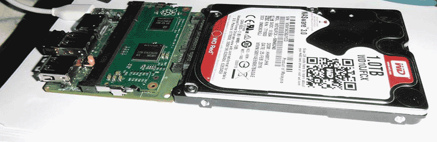
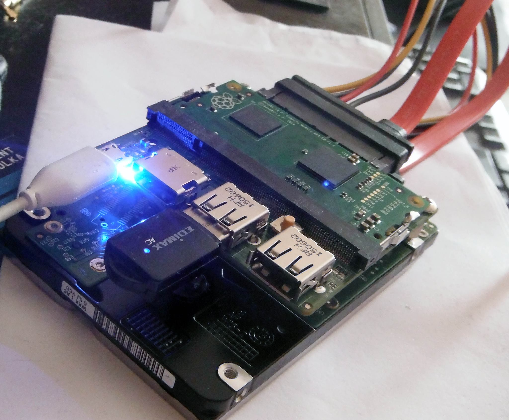

# WDPi

Western Digital / Raspberry Pi Compute Module based mini NAS.

WDPi began as a small, low-power NAS build based on a Raspberry Pi Compute Module 3 and a Western Digital SATA adapter board. The original setup provided Samba file sharing on the local network and a lightweight read-only directory view through MiniHTTPD.

The same device has remained in continuous practical use since the original deployment. This repository therefore serves two related purposes:

- it preserves the original hardware build and boot-time configuration;
- it documents the server's later evolution as a Samba and FTP storage appliance.

In July 2026, the existing server configuration was consolidated, a dedicated scan-to-FTP destination was added for a network multifunction printer, the live MiniHTTPD directory view was aligned with the current storage tree, and Samba 4.10.18 was compiled natively on the original Compute Module hardware as a documented legacy compatibility artifact. The new Samba build was subsequently deployed as the production `smbd` and `nmbd` implementation and validated after a full reboot.

This is a historical build log and a sanitized configuration snapshot, not a maintained NAS distribution or a secure-by-default deployment image.

## Original project

The original topology was:

```text
2.5" SATA disk
    -> Western Digital SATA adapter board
    -> Raspberry Pi Compute Module 3
    -> local network
    -> Samba share and MiniHTTPD directory view
```

The USB Wi-Fi adapter was an important part of the build. At the time, Raspberry Pi Linux did not work reliably with every USB Wi-Fi device, especially among faster adapters, so documenting a working adapter had practical value for other hobbyists.

### Original hardware

- Western Digital [2.5-inch SATA to Raspberry Pi Adapter](http://wdlabs.wd.com/products/sata-adapter-board/)
- Raspberry Pi Foundation [Compute Module 3](https://www.raspberrypi.org/blog/raspberry-pi-compute-module-new-product/)
- Edimax ED600 USB Wi-Fi adapter
- Seagate SSHD 1 TB

### Original software and services

- Raspbian
- Samba for LAN file sharing
- MiniHTTPD for a lightweight web view
- `tree` for generating a static HTML directory listing at boot
- `hdparm` for HDD power-management settings

## Historical boot-time behavior

The included [`rc.local`](rc.local) file records the original workflow:

1. print the current IP address;
2. mount the attached storage device at `/nas`;
3. bind-mount `/nas` into MiniHTTPD's web root;
4. apply HDD standby and power-management settings with `hdparm`;
5. generate a static HTML directory tree with `tree`;
6. start MiniHTTPD after a short delay.

The generated directory snapshot was written to:

```text
/nas/tree.html
```

This was a boot-time snapshot rather than a recurring cron task. The historical [`mini-httpd.conf`](mini-httpd.conf) is retained as an anonymized example.

## Current deployment (2026)

The continuously used device now operates primarily as a small Samba and FTP storage server. Its current logical layout includes:

- Samba file sharing for authenticated users on the local network;
- vsftpd access with separate authenticated and anonymous policies;
- a LAN-bound MiniHTTPD service providing a live, read-only directory view of the `/ftp` storage tree;
- two personal areas, each writable by its owner and readable by the other authenticated user;
- a common `share` area that authenticated users can modify and anonymous FTP users can only read;
- an anonymous read/write `upload` area stored on a separate USB flash drive;
- an isolated FTP account and directory added in July 2026 for a network multifunction printer's scan-to-FTP function;
- read-only access for the human users to files created by the printer;
- read-only web access to the printer's storage directory through the server-wide MiniHTTPD view;
- POSIX ACLs and default ACLs implementing the directory-level access model;
- UUID-based mounts in `/etc/fstab`;
- systemd mount dependencies preventing the file services from starting before their required data filesystems are mounted.

For the printer account, FTP path `/` maps directly to its private physical directory. The printer cannot see the shared, upload or personal areas through FTP. The server-side login and upload path have been tested; an actual scan initiated at the printer remains an on-site acceptance test.

MiniHTTPD exposes the storage tree as a read-only browser on the trusted local network. This includes the printer's FTP storage directory. The web view is broader than the printer account's isolated FTP view: it presents the server-wide `/ftp` tree rather than applying the printer account's FTP chroot. It is therefore an administrative convenience intended only for a trusted LAN, not a public web interface.

The public repository intentionally excludes passwords, password hashes, public hostnames, routable addresses, real filesystem UUIDs and private filenames.

Detailed current documentation is available in:

- [`docs/current-deployment.md`](docs/current-deployment.md) — storage topology, services and access model;
- [`docs/maintenance-2026-07-15.md`](docs/maintenance-2026-07-15.md) — consolidated FTP, ACL and mount maintenance record;
- [`docs/maintenance-2026-07-21.md`](docs/maintenance-2026-07-21.md) — production Samba migration, DHCP cleanup and reboot validation;
- [`config/`](config/) — sanitized examples of the active Samba, vsftpd, PAM, ACL, mount and systemd configuration.

## Native Samba 4.10.18 build

In July 2026, Samba 4.10.18 was compiled directly on the physical WDPi Compute Module 3 rather than cross-compiled on another system. The build used Raspbian GNU/Linux 8 Jessie, GCC 4.9.2, binutils 2.25 and Python 2.7.9 for Waf.

The resulting binaries use a 32-bit ARM EABI5 hard-float ABI with an ARMv6/VFPv2 instruction baseline and install under `/opt/samba-4.10.18`, alongside rather than over the packaged Samba 4.2 installation.

Recorded work took approximately 1 hour 40 minutes for configuration, compilation and staged installation. The build was first validated with an isolated `smbd` instance on `127.0.0.1:1445`, successful directory listing and file upload, and a full dynamic-dependency audit with no unresolved ELF dependencies on the build host. It was then deployed through native systemd units as the production `smbd` and `nmbd`, using the existing `/etc/samba/smb.conf`, and successfully validated after reboot on TCP ports 139/445 and UDP ports 137/138.

The [`samba/`](samba/) directory contains the build provenance, host metadata, feature matrix, ABI record and source checksum. Binary and source archives are distributed as GitHub Release assets rather than committed as ordinary repository files.

This legacy build is preserved for historical and compatibility purposes. Samba 4.10.18 and Raspbian Jessie are obsolete and should not be treated as a current secure-by-default platform.

## Repository layout

```text
README.md                         Historical and current project overview
rc.local                         Historical boot workflow
mini-httpd.conf                  Historical MiniHTTPD example
wdpi_current_2026.jpg            Current hardware state in July 2026
config/                          Sanitized current configuration examples
docs/current-deployment.md       Current topology and access model
docs/maintenance-2026-07-15.md   FTP, ACL and mount maintenance record
docs/maintenance-2026-07-21.md   Samba migration and reboot validation
samba/                           Native Samba 4.10.18 build documentation
```

## Images

### Current WDPi hardware state (July 2026)

The current assembly uses the original Compute Module and SATA adapter platform with attached USB network and storage devices.


### Historical images

Original WDPi project image:



Later project revision:



## Current limitations

- The operating system and many packages reflect the original deployment era and are obsolete.
- The current FTP configuration uses unencrypted FTP for compatibility with legacy and embedded clients.
- MiniHTTPD is an old, unauthenticated read-only directory browser and is intentionally bound to the trusted local network.
- The MiniHTTPD view covers the server-wide `/ftp` tree and is therefore broader than the isolated views presented to individual FTP accounts.
- Anonymous write access is intentionally restricted to one ACL-controlled upload filesystem.
- The repository configurations are sanitized examples and must be reviewed before use on another system.
- The native Samba 4.10.18 build is a legacy compatibility artifact, not a maintained security release.
- This setup should not be exposed to an untrusted network without current packages, restricted network access, firewalling, logging, transport security and a fresh security review.

## Authorship and media rights

Project documentation and photographs by Tomáš Gál, unless otherwise noted.

External project links and product names are included for hardware identification and historical context.
